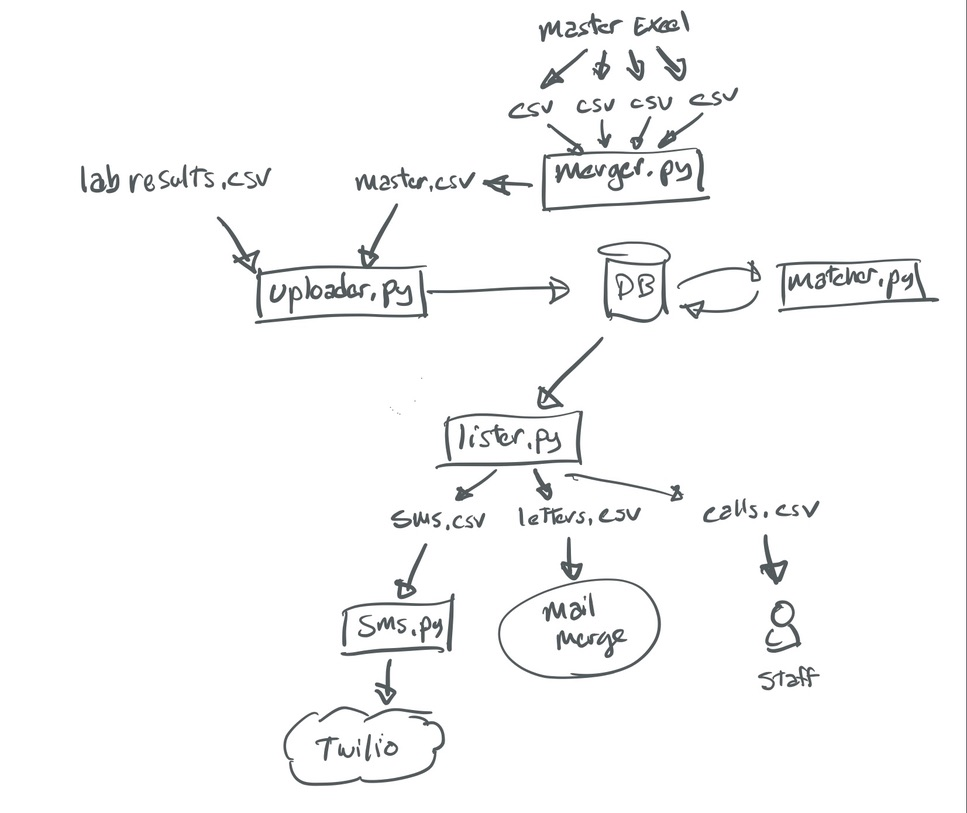

# Covid mobile clinics Results Processing

My client was requested by the government to setup multiple mobile Covid-19 testing clinics around Melbourne, mostly targeting public housing projects that have been particularly affected in the infection second wave.

The initial data is entered by staff in the field in multiple Excel worksheets, which had to be consolidated with results coming back from the lab. The manual work involved resulted in multiple days of delays between reception of the results and communication with the client.

This repo contains a series of scripts to consolidate both Excel data and lab results into a database, and generate a contact list every day.
This process allows clients to be notified (phone, sms) on the same day as the organisation receiveds the results, and next day by mail.

The majority of the work in this project involved cleaning up and fixing the Excel data mis entered in the field.

A second team is involved in a project to create a proper Web interface with input validation instead of relying on Excel.




## Postgresql Setup

We use a dockerised PostgreSQL database.<br>
Setup instructions for macOS.

### Install psql 
```
brew update
brew install libpq
brew link --force libpq 

source env.sh  # contains PG user, password vars
```

### Python3 driver
NOTE: I'm installing the binary after issues with compiling from src.
The binary is not recommended for prod.
```
python -m pip install psycopg2-binary
```

### Start db
```
docker-compose -f production.yml up -d
```

### Create db
```
docker exec -it postgres createuser -U postgres starhealth 
docker exec -it postgres createdb -U postgres db

docker exec -i postgres psql -U postgres covid < 00-migration.sql
```

### Seed Data
```
python3 feeddb.py
```

### Utilities
Log inside
```
docker exec -it postgres psql -U postgres covid

````
